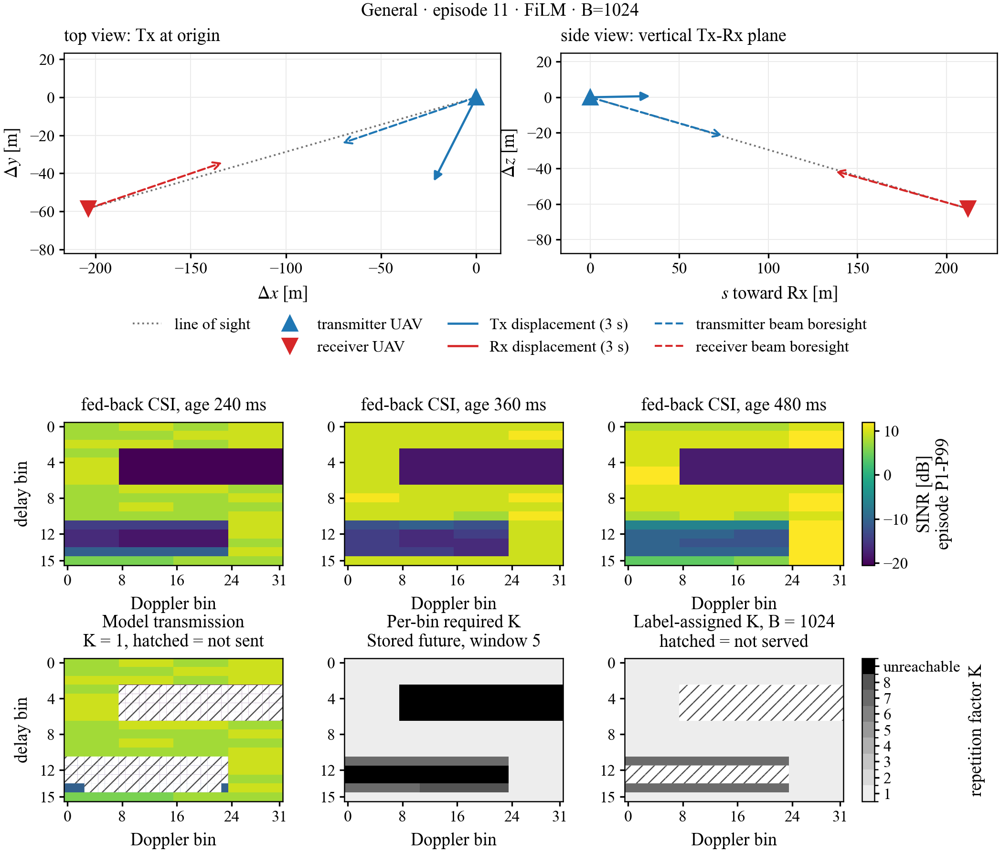
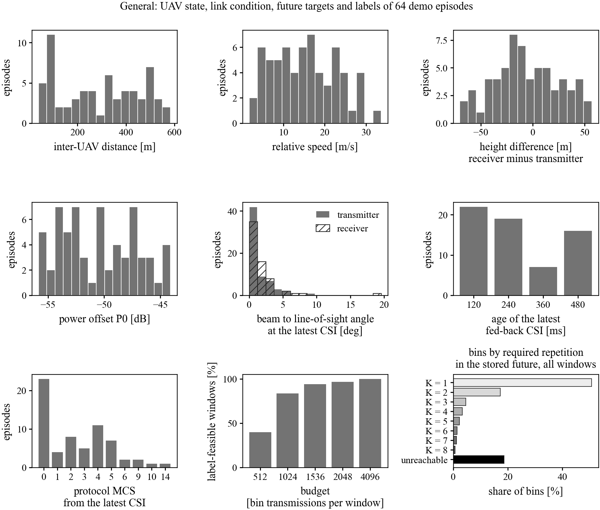

# OSBS trained models and inference

This folder is the public inference package for the trained One-Shot Block Scheduling (OSBS) networks. The public entry points are `osbs_infer.py` and `predict.py`; they map causal UAV-to-UAV observations to served delay-Doppler bins and a repetition factor for each scheduled window.

## Contents

- `osbs_infer.py`: checkpoint loading, observation transforms, the scheduler, protocol-MCS constants, and the decision rule.
- `predict.py`: command-line inference and optional scoring when stored future data are present.
- `demo_data/`: 64 held-out test episodes from each corpus, with observations and stored evaluation data.
- `checkpoints/`: one `best.pt` checkpoint for every corpus arm, budget, and model variant, plus `SHA256SUMS`.

The inference code is MIT-licensed. The trained checkpoints and all demo data, including the static demo figures, are CC BY 4.0; see `LICENSE.md`.

The historical `futian` path identifies the ray-traced Leipzig urban-demo corpus. It does not denote Futian or Shenzhen. The `general` arm uses the General corpus; `futian/fine_tuned` contains General models fine-tuned on Leipzig episodes, and `futian/site_only` contains models trained from scratch on that corpus.

Budgets are 512, 1024, 1536, 2048, and 4096 bin transmissions per window. Variants are `nonav` (delay-Doppler input only), `film` (navigation through FiLM), `res` (navigation through the residual level head), and `hybrid` (both).

## Install and run

Python 3.10 or later is required.

```bash
python3 --version
pip install -r requirements.txt
python3 predict.py
```

Run these commands from this package folder. With no arguments, `predict.py` uses `checkpoints/general/B1024/film/best.pt`, reads `demo_data/general`, and evaluates episodes 11 and 53 at windows 0, 5, and 11. For `--checkpoint` and `--corpus`, an existing path is used first and otherwise the same relative path is resolved under this package folder; `--out` is relative to the current working directory. The main options are:

```text
--checkpoint PATH   checkpoint to load
--corpus PATH       folder containing observations.h5
--episodes N ...    episode indices in that folder
--windows N ...     window indices 0..11
--device DEVICE     cuda or cpu
--budget B          actual per-window budget; defaults to the checkpoint budget
--increment D       validation-selected K increment in 0..7; defaults to 0
--out PATH.npz      optional output with serve, base/final K, level, pairs, budget, and increment
```

For example:

```bash
python3 predict.py \
  --checkpoint checkpoints/futian/fine_tuned/B1024/film/best.pt \
  --corpus demo_data/futian --episodes 0 1 --windows 0 5 11 --device cpu
```

The code also accepts a derived released-corpus folder containing `observations.h5`; it does not require the full training repository. `predict.py` scores a decision on the stored future only when the folder also contains `targets.h5` and `budget_labels.h5`. Otherwise it prints the model decision without claiming future performance.

Load checkpoints only from a source you trust. To verify the integrity of a
downloaded package copy, run this command from the package directory:

```bash
shasum -a 256 -c checkpoints/SHA256SUMS
```

Only use a checkpoint whose corresponding line reports `OK`. This verifies the downloaded package copy; it does not establish that the file is byte-identical to an original paper-run checkpoint or reproduce paper metrics.

## Python API

The package runs on CPU; CUDA is selected when available by the command-line default. In the Python API, paths are interpreted relative to the caller's current working directory unless made absolute.

```python
from osbs_infer import decide, load_checkpoint, load_observations

net, checkpoint = load_checkpoint("checkpoints/general/B1024/film/best.pt", "cpu")
obs = load_observations("demo_data/general", [11, 53])
serve, K, level = decide(
    net, checkpoint, obs,
    rows=[0, 0, 1], windows=[0, 5, 0], device="cpu",
)
```

The call above preserves the original API and uses the checkpoint budget with zero increment. To apply a deployment
budget and a validated post-calibration increment while retaining the base decision for audit, use:

```python
serve, K, level, base_K = decide(
    net, checkpoint, obs,
    rows=[0, 0, 1], windows=[0, 5, 0], device="cpu",
    budget=2048, increment=1, return_base_k=True,
)
```

An increment must be selected on validation data for the exact checkpoint, population, budget, and preprocessing
setting where it will be used. It is not inferred from a released checkpoint. Released checkpoint copies are not
asserted to have the same file hashes as the original paper-run checkpoints, so supplying a paper-reported increment
to this package does not by itself establish reproduction of the paper metrics.

For an episode, `observations.h5` provides:

- `Z_dd`: `[16, 32, 3]` normalized latest-field features. The channels are clipped SINR in dB over `[-30, 60]` divided by 20, `ln(1 + SINR)`, and the negative z-score of `ln(1 + SINR)` over the field.
- `csi_field_db`: `[3, 16, 32]` fed-back block CSI in dB, newest first. Each block value is repeated across its eight Doppler bins.
- `csi_age_ms`: `[3]`, with latest age `a` selected from 120, 240, 360, and 480 ms and the other ages `a+120` and `a+240` ms, so the oldest can be 720 ms.
- `beam_phase_ms`: `[2]` re-aim phases in ms.
- `p0_db`: the reference-link power offset in dB.
- `z_nav`: `[13]` navigation values in metres, metres per second, and radians: relative position, both velocities, and both commanded beam azimuth/elevation angles.
- `mu_p`: the protocol MCS index, 0 through 22.

The model output has a candidate `serve` mask with shape `[P, 512]` for the 16 by 32 grid, where `P` is the number of requested episode-window pairs, and final `K` with shape `[P]` and values 1 through 8 or 0 when the window is skipped. `rows` indexes the episode array selected by `load_observations`; it is not a source-corpus episode ID. `level` has shape `[P, 2]` and contains the predicted median and 0.2-quantile level change in dB. A `K=0` result skips the entire window, so candidate-mask entries are not transmitted. Otherwise, transmitted bins use `mu_p`. With an increment, a feasible base action becomes `min(base_K + increment, 8, floor(budget / served))`; an empty or base-skipped action stays skipped, and an already over-budget base action is skipped rather than reduced.

There are 12 scheduled windows. Window `w` has its eight consecutive 1 ms repetition opportunities beginning at `80*w + 1` ms after the decision subframe; the window centre used by the network is `80*w + 4.5` ms. The rule applies the predicted 0.2-quantile minus the checkpoint's `rule_offset_db` to the latest feedback, converts each bin to linear SINR, multiplies by each candidate K, and applies per-MCS EESM. Under this stationary SINR surrogate, the rule selects the smallest K in 1..8 whose EESM value meets the protocol-MCS 1% BLER threshold and whose candidate-bin count times K fits the budget. If none qualifies, K=0. Reliability on the stored future is assessed separately.

## Demo data and figures

Each demo corpus contains 64 held-out test episodes with `observations.h5`, `targets.h5`, and `budget_labels.h5`. The observations are the causal model input. The targets contain clean future SINR for the eight repetition opportunities in each of 12 windows and the per-bin smallest required K, with 9 meaning unreachable within eight repetitions. Budget labels contain feasibility, usage, utility, and the label action for each supported budget. The demo manifest records source episode IDs, fields, sizes, and hashes. See `demo_data/README.md` and the released-corpus `release_corpus.py derive` documentation for the file contract.

The included PNGs in `demo_data/figures/` are static illustrations of the demo state, CSI, stored future, and model decision.

`visualize_demo.py` is an optional plot-generation script. It is not included in a minimal inference release and is not required by the CLI or Python API; the required runtime dependencies are exactly those in `requirements.txt`.





Each demo corpus uses episode indices 0 through 63. In the General examples, full-corpus episode IDs 3239 and 15947 correspond to demo indices 11 and 53. The Leipzig demo remains under the historical `futian` directory and key for compatibility.

## Evaluation boundary

A checkpoint consumes only the causal observation fields listed above. Future SINR, future repetition maps, budget feasibility, and labels are opened only by the optional scoring functions when those stored files are supplied. This lets the same inference code run on a released corpus with observations alone, while `predict.py` can report strict stored-future BLER and label information for a demo subset.
